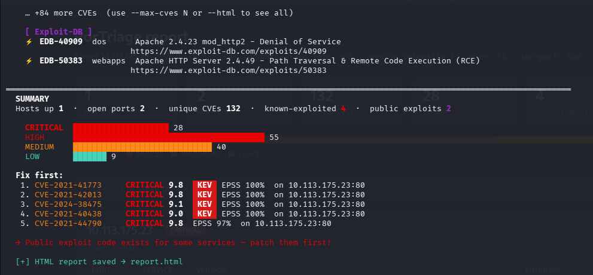
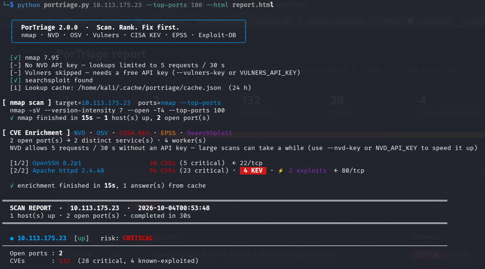
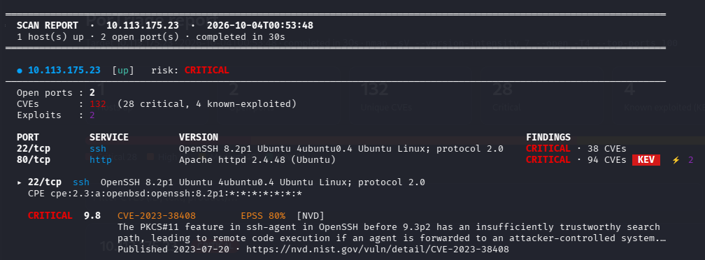

# PorTriage

**Scan. Rank. Fix first.**

[](https://www.python.org/)
[](LICENSE)
[](https://nmap.org/)
[](#requirements)

> **nmap tells you what's open. PorTriage tells you what to fix first.**

<p align="center">
  
</p>

PorTriage (*port* + *triage*) is a Python command-line tool that scans a host (or network range) with **nmap**, fingerprints the services running on open ports, and then checks each service against several live vulnerability databases and the **Exploit-DB** archive to show which known CVEs and public exploits may apply. Findings are ranked using **CISA KEV** (vulnerabilities attackers are actively exploiting) and **FIRST EPSS** (probability of exploitation), so you know what to fix first.

> ⚠️ **Legal notice:** Only scan systems you own or have explicit written permission to test. Unauthorized port scanning may be illegal in your jurisdiction.

---

## Quick start

```bash
git clone https://github.com/adhamelsonny014-dot/PorTriage-Port-Scanner.git
cd PorTriage-Port-Scanner
pip install -r requirements.txt          # plus nmap itself — see Requirements

# scanme.nmap.org is provided by the nmap project for test scans
python portriage.py scanme.nmap.org --top-ports 100 --html report.html
```

---

## Why PorTriage?

A version scan gives you a list of services. Turning that into "what do I patch first?" usually means looking up every version by hand. PorTriage does that step for you and puts the result in order.

| | `nmap -sV` | `nmap --script vulners` | **PorTriage** |
|---|:---:|:---:|:---:|
| Open ports & service versions | ✅ | ✅ | ✅ |
| Versions matched to CVEs | — | ✅ Vulners | ✅ NVD + OSV (+ Vulners) |
| Public exploits from Exploit-DB, with links | — | flags some | ✅ via searchsploit |
| Flags CVEs exploited in the wild (CISA KEV) | — | — | ✅ |
| Exploit probability (FIRST EPSS) | — | — | ✅ |
| Ranked "fix first" list & per-host risk | — | — | ✅ |
| HTML / CSV reports | — | — | ✅ |
| Compare with a previous scan | via `ndiff` | — | ✅ `--compare` |
| Exit code for CI / cron | — | — | ✅ `--fail-on` |

**What it isn't:** PorTriage matches *versions* to known CVEs — it doesn't log in to hosts, test web apps, or confirm that a vulnerability is exploitable. For authenticated or in-depth assessments use a full scanner such as OpenVAS/Greenbone or Nessus; PorTriage is the fast, lightweight first pass.

---

## Features

- **Service & version detection** using nmap (`-sV --version-intensity 7`), optional **OS detection** (`-O`), `--top-ports`, timing templates and pass-through nmap arguments
- **Live CVE lookups** from three free sources:
  | Source | What it provides | Key needed? |
  |---|---|---|
  | [NIST NVD API v2](https://nvd.nist.gov/developers/vulnerabilities) | The official CVE database, queried by CPE 2.3 (exact name, then applicability match), falling back to keyword search | No (optional, for speed) |
  | [OSV.dev](https://osv.dev/) | Google's open vulnerability database — Linux-distro advisories (Debian, Ubuntu, Alpine, …) for the detected package and version | No |
  | [Vulners](https://vulners.com/) | Large CVE / exploit index, queried by software + version | **Yes** (free) |
- **Threat-intel prioritisation**
  - [CISA KEV](https://www.cisa.gov/known-exploited-vulnerabilities-catalog) — flags CVEs known to be exploited in the wild (and those used in ransomware campaigns)
  - [FIRST EPSS](https://www.first.org/epss/) — the probability a CVE will be exploited in the next 30 days
  - A **"Fix first"** list ranks findings by KEV → CVSS → EPSS, and every host gets an overall **risk rating**
- **Exploit discovery** via `searchsploit` (offline Exploit-DB mirror), with direct exploit-db.com links
- **Smart CPE handling** — converts nmap's CPE 2.2 URIs to the CPE 2.3 format NVD requires, and builds CPEs for ~45 common products (Apache, nginx, OpenSSH, MySQL, Redis, Tomcat, …) when nmap does not report one
- **De-duplicated, CVSS-sorted results** with severity ratings (CRITICAL / HIGH / MEDIUM / LOW); CVSS v3 vectors from OSV are converted to base scores
- **Fast enrichment**
  - Each distinct service is looked up **once**, even if it runs on many hosts (e.g. the same OpenSSH across a /24)
  - Lookups run **in parallel** (`--workers`, default 4) with keep-alive HTTP connections
  - A **local cache** (24 h by default) makes re-scans almost instant and spares the NVD rate limit
  - **Sliding-window NVD rate limiting** shared across threads — uses the full allowance instead of a fixed delay — with automatic retry when rate-limited
  - One NVD request returns every match for a CPE (no truncated results)
- **Polished terminal output** — live progress spinner, port overview table, wrapped descriptions with links, severity bar chart, and graceful **Ctrl+C** (shows partial results instead of losing the scan)
- **Reports**: **JSON**, **CSV** (one row per finding — handy for spreadsheets/ticketing), and a self-contained **HTML** report with search, severity filter and light/dark mode
- **Change tracking** — `--compare old.json` shows newly opened/closed ports, version changes and newly matching CVEs
- **CI-friendly** — `--fail-on high` exits with code 2 when findings reach a severity; `--no-color` / `NO_COLOR`
- **Flexible targets** — several targets, nmap ranges (`10.0.0.1-50`), CIDRs, or a file (`-iL targets.txt`)

---

## How it works

```
 target ──► nmap -sV scan ──► open ports + product/version/CPE
                                       │
                                       ▼
              group identical services (one lookup per distinct service)
                                       │
                                       ▼
                 ┌──────── parallel, cached enrichment ─────────┐
                 │  NVD (CPE or keyword)  ·  OSV  ·  Vulners    │
                 │  searchsploit (Exploit-DB)                   │
                 └──────────────────────────────────────────────┘
                                       │
                                       ▼
            CISA KEV flags + EPSS scores ► de-duplicate ► rank (KEV → CVSS → EPSS)
                                       │
                                       ▼
                  terminal report  ·  JSON  ·  CSV  ·  HTML  ·  --compare
```

---

## Requirements

- **Python 3.10+** (3.12+ recommended)
- **nmap** installed and on your `PATH`
  - Windows: https://nmap.org/download.html (make sure "add to PATH" is enabled)
  - Debian/Ubuntu/Kali: `sudo apt install nmap`
  - macOS: `brew install nmap`
- **searchsploit** *(optional — Exploit-DB checks are skipped without it)*
  - Debian/Ubuntu/Kali: `sudo apt install exploitdb`
  - macOS: `brew install exploitdb`
- Python packages:

```bash
pip install -r requirements.txt
```

---

## Usage

```bash
python portriage.py <target> [options]
```

`<target>` can be an IP address, a hostname, a CIDR range or an nmap range (`10.0.0.1-50`). Several targets can be given at once.

### Options

**Targets & scanning**

| Option | Description |
|---|---|
| `-iL`, `--input-list FILE` | Read targets from a file (one per line, `#` comments allowed) |
| `-p`, `--ports` | Port range to scan (default: `1-1024`) |
| `--full` | Scan all 65535 ports |
| `--top-ports N` | Scan nmap's N most common ports (fast) |
| `-T`, `--timing 0-5` | nmap timing template (default: `4`; nmap's own default is `3`) |
| `-O`, `--os-detect` | nmap OS detection (needs root / Administrator) |
| `--nmap-args "ARGS"` | Extra nmap arguments, e.g. `"-Pn"` or `"-sS -sU"` |

**Vulnerability lookups**

| Option | Description |
|---|---|
| `--no-cve` | Skip all CVE enrichment (nmap only) |
| `--no-osv` | Skip OSV.dev lookups |
| `--no-searchsploit` | Skip SearchSploit / Exploit-DB checks |
| `--no-kev` | Skip CISA KEV "known exploited" flags |
| `--no-epss` | Skip FIRST EPSS exploit-probability scores |
| `--nvd-key KEY` | NIST NVD API key (raises the rate limit from 5 to 50 requests / 30 s). Also read from `NVD_API_KEY` |
| `--vulners-key KEY` | Vulners API key (Vulners is skipped without one). Also read from `VULNERS_API_KEY` |
| `-w`, `--workers N` | Parallel service lookups (default: 4; NVD stays rate-limited) |
| `--no-cache` | Don't read or write the local lookup cache |
| `--cache-ttl HOURS` | How long cached lookups stay valid (default: 24) |

**Output**

| Option | Description |
|---|---|
| `--min-severity LEVEL` | Only report CVEs at or above `low` / `medium` / `high` / `critical` (KEV CVEs are always kept) |
| `--max-cves N` | Max CVEs shown per port in the terminal (default: 10) |
| `--max-exploits N` | Max exploits shown per port in the terminal (default: 10) |
| `-o`, `--output FILE` | Save the full report as JSON |
| `--html FILE` | Save a self-contained HTML report |
| `--csv FILE` | Save findings as CSV (one row per CVE / exploit / open port) |
| `--compare OLD.json` | Show what changed since a previous JSON report |
| `--fail-on LEVEL` | Exit with code 2 if any CVE at or above `LEVEL` is found (for CI / cron) |
| `--no-color` | Disable colours (also honours the `NO_COLOR` environment variable) |

### Examples

```bash
# Scan the default port range (1-1024)
python portriage.py 192.168.1.1

# Scan specific ports
python portriage.py 192.168.1.1 -p 22,80,443,3306

# Full port scan, saving JSON + HTML reports
python portriage.py 10.0.0.1 --full -o report.json --html report.html

# Quick sweep of a subnet's 100 most common ports, only high/critical findings
python portriage.py 10.0.0.0/24 --top-ports 100 --min-severity high

# Targets from a file, findings to CSV
python portriage.py -iL targets.txt --csv findings.csv

# Use an NVD API key (from the environment) and more workers
export NVD_API_KEY=YOUR_KEY
python portriage.py 10.0.0.5 --workers 8

# Weekly check: what changed since last time?
python portriage.py 10.0.0.5 --compare last-week.json -o this-week.json

# Fail a CI job / cron check when critical issues are found
python portriage.py 10.0.0.5 --fail-on critical

# OS detection + SYN scan, treating hosts as up even if they ignore ping
sudo python portriage.py 192.168.1.0/24 -O --nmap-args "-sS -Pn"

# Show more results per port
python portriage.py 10.0.0.5 --max-cves 25 --max-exploits 25

# Scan a subnet with only NVD + Vulners
python portriage.py 192.168.1.0/24 --no-osv --no-searchsploit
```

> 💡 Some nmap detection features need elevated privileges — run with `sudo` (Linux/macOS) or an Administrator terminal (Windows) if service detection is incomplete.

---

## API keys (optional, free)

The tool works without any keys, using NVD, OSV, CISA KEV and EPSS. Keys can be passed as flags or, to keep them out of your shell history, as the `NVD_API_KEY` / `VULNERS_API_KEY` environment variables.

- **NVD:** https://nvd.nist.gov/developers/request-an-api-key — without a key NVD allows about 5 requests per 30 seconds, so the scanner waits ~6.5 s between NVD requests. With a key the wait drops to 0.7 s.
- **Vulners:** https://vulners.com/ (free registration) — Vulners blocks anonymous API requests, so it is only queried when you pass `--vulners-key`.

---

## Output

### Terminal report

<p align="center">
  
</p>

<p align="center">
  
</p>

For each host the report shows an overall risk rating, the OS guess (with `-O`), and a table of open ports with their service, version and findings. Each affected port is then detailed: every CVE shows its severity, CVSS score, ID, **KEV** badge, **EPSS** probability, source, a short description, publish date and link; each exploit shows its EDB-ID, type, title and Exploit-DB URL. The summary at the end has a severity bar chart and a **"Fix first"** list of the most urgent CVEs.

### HTML report (`--html`)

A single self-contained file (no external assets) with summary cards, a severity bar, per-host port tables and collapsible per-port CVE / exploit tables. It includes a search box and a severity filter, and follows the system's light/dark mode — easy to share with a team or attach to a ticket.

### CSV report (`--csv`)

One row per finding (`cve`, `exploit`, or `open-port` for ports without findings) with host, port, service, version, ID, severity, CVSS, EPSS, KEV, source and URL — ready for a spreadsheet or ticketing import.

### JSON report (`-o`)

```json
{
  "target": "192.168.1.1",
  "scan_time": "2026-10-01T12:00:00",
  "nmap_args": "-sV --version-intensity 7 --open -T4",
  "durations": { "nmap": 41.2, "enrichment": 18.7 },
  "complete": true,
  "hosts": [
    {
      "ip": "192.168.1.1",
      "hostname": "router.local",
      "state": "up",
      "os": [ { "name": "Linux 5.0 - 5.14", "accuracy": "96" } ],
      "ports": [
        {
          "port": 22,
          "proto": "tcp",
          "service": "ssh",
          "product": "OpenSSH",
          "version": "OpenSSH 8.9p1 Ubuntu",
          "cpe": "cpe:2.3:a:openbsd:openssh:8.9p1:*:*:*:*:*:*:*",
          "checked": true,
          "live_vulns": [
            { "source": "NVD", "cve": "CVE-XXXX-XXXXX", "severity": "HIGH", "cvss": 7.5,
              "kev": true, "epss": 0.42, "epss_percentile": 0.97, "...": "..." }
          ],
          "exploits": [
            { "title": "...", "edb_id": "12345", "url": "https://www.exploit-db.com/exploits/12345" }
          ]
        }
      ]
    }
  ]
}
```

---

## Known limitations

- Vulnerability matching is based on the product/version string nmap reports, so results can include **false positives** (or miss issues if the version is not detected). Always verify findings manually.
- **Backported patches** are only detected for Ubuntu and Debian packages whose build nmap reports (e.g. `OpenSSH 8.2p1 Ubuntu 4ubuntu0.4`): PorTriage then checks OSV results against that exact package version, using the distro's own advisories. For other systems, NVD results and upstream-version matches may flag CVEs a distro has already patched.
- OSV advisories are re-checked against their affected version ranges (Debian/Ubuntu version rules, epochs included). Records without usable version ranges are kept, so a few OSV results may still be broader than the real affected range.
- Without an NVD key, the first scan of many different services is slow because of NVD's public rate limit (repeat services and re-scans are served from the cache).
- Lookup results are cached for 24 h by default in `~/.cache/portriage/` (`%LOCALAPPDATA%` on Windows). Use `--no-cache` or `--cache-ttl` to change this.
- `searchsploit` is a Linux/macOS tool; on Windows run the scanner from WSL to get Exploit-DB results.

---

## Contributing & security

Bug reports, feature ideas and pull requests are welcome — please open an issue. To report a security problem in PorTriage itself, see [SECURITY.md](SECURITY.md).

---

## License

[MIT](LICENSE) © 2026 Adham Elsonny

---

## Disclaimer

This tool is intended for **educational purposes and authorized security assessments only**. The author is not responsible for any misuse or damage caused by this program.
